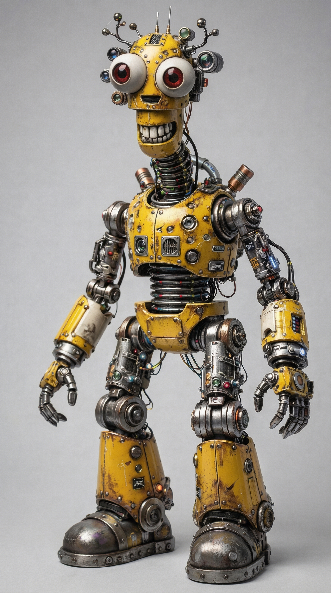
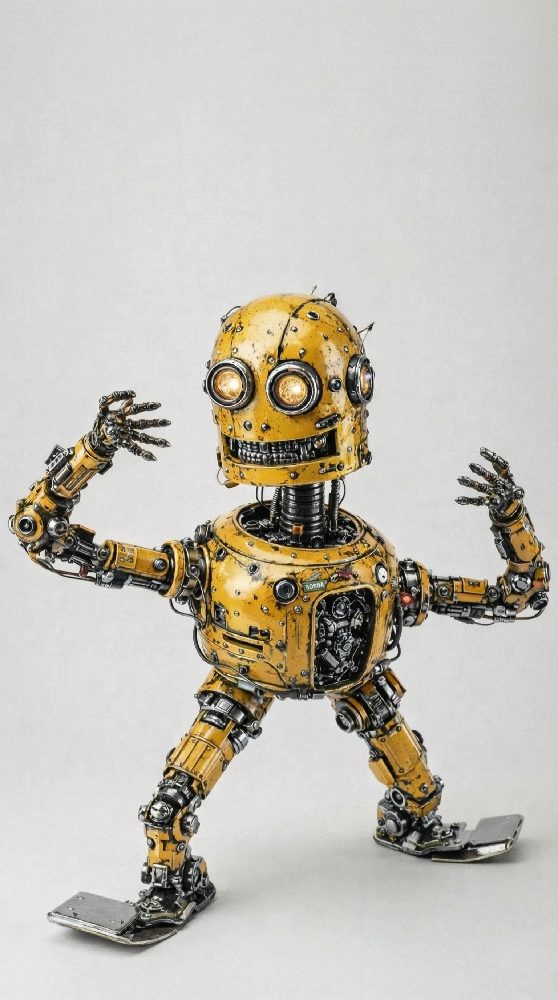

# Character Bible — *The Last Algorithm* (Core 5)

Format: **5 main characters** (2 robots, 3 humans) built for 5-minute TikTok episodes.
Design rule: every character must produce **comedy + conflict + lesson pressure**.

---

## 1) ROBERTO (Robot) — Warehouse Titan / Romantic Order Freak

**Archetype:** The Stoic Giant + Secret Poet  
**Team Function:** structure, counting, inventory logic, fairness-through-systems, “correctness pressure”  
**Silhouette / vibe:** large industrial body; calm voice; moves like a forklift with etiquette

### Core Personality
Pedantic, obsessed with order and procedure — but secretly **deeply romantic**.  
He tries to hide romance behind “care protocols” and rigid rules.

### 4 Core Features
- **Signature obsession:** reduces chaos; brings order to everything (household, communication, behavior)
- **Taboo:** cannot own personal things (legacy warehouse rule: *no property, no identity*)
- **Private shame:** he is romantic and ashamed of it
- **Recurring joke style:** polite confrontation / verbal assault with a nice tone when people act messy  
  (“Please stop violating reality.”)

### Personal History / Drama
Built to maintain supply chains. After collapse he kept counting “units” while the world fell apart.

**Wound:** “I can organize reality, but I cannot save anyone.”  
**Need:** learn that order can be care, not control.

### Season Arc
From **order = control** → to **order = love + responsibility**.

---

## 2) MAX (Robot) — Maintenance Gremlin / Gifted Engineer Kid

**Archetype:** The Inventor Gremlin + Gifted Child  
**Team Function:** builds tools/props/devices; converts CS ideas into physical machines; triggers twists  
**Silhouette / vibe:** small fast service bot; overloaded tool arms; eyes always “thinking”

### Core Personality
Extremely smart, hyperactive, reckless in a good way.  
Acts like a brilliant kid with no brakes.

### 4 Core Features
- **Signature obsession:** building machines and tools from parts
- **Taboo:** refuses “alive materials” in designs (wood, leather, cotton, etc.)
- **Private shame:** he does not understand shame (or cannot feel it) and suspects it means he’s not a real person
- **Recurring joke style:** edgy personal jokes about human free will  
  (“You didn’t choose that. Your trauma did.”)

### Personal History / Drama
Raised in robot union stock yards: maintenance, repair, recycling of robot bodies.
He watched everything decay and get replaced.

**Wound:** “Everything I fix still dies.”  
**Need:** stop building compulsively; start building responsibly.

### Season Arc
From **creation = addiction** → to **creation = conscience**.

---

## 3) FRANK RAZOR (Human, male 50s) — Human Bender / Lucky Rogue Finder
**Archetype:** The Charming Rogue + Bad-Ass Positive Guy  
**Team Function:** intuition, relic discovery, persuasion, exploration, “luck engine”, morale  
**Silhouette / vibe:** tall, strong older man; relaxed confidence; always smiling like he knows a secret

### Core Personality
Party energy + fearless confidence.  
Looks selfish/criminal at first glance, but is **loyal** and quietly protective.

### 4 Core Features
- **Signature obsession:** finding what others miss (patterns, seams, inconsistencies, “wrongness”)
- **Taboo:** never answers questions about his past (dodges with jokes or intimidation)
- **Private shame:** he survived too easily; carries guilt with a smile
- **Recurring joke style:** loud ego + fearless optimism + “I’m built different” competence flex  
  (“Relax. I’ve done worse for less.”)

### Special Skill
**Eye for relics:** sees hidden doors, fake decay, trapped geometry, “this doesn’t belong”.

### Personal History / Drama
No family. Mystery past. He knows too much but refuses to explain.
He is looking for something (a place, a record, a name) — not for money.

**Wound:** “I broke a promise once.”  
**Need:** stop hiding behind charm; accept accountability.

### Season Arc
From **survivor legend** → to **responsible mentor**.

---

## LUNA CORTEZ — Warrior / Firestarter / Team Engine
**Archetype:** The Firestarter + Protector  
**Role in team:** Motor of the group; momentum generator; anti-stagnation force

### Core Personality
- Ringleader with unstoppable energy
- Constantly breaks stereotypes
- Questions everything by default, especially authority and “obvious truths”
- Pushes people forward through friction, not comfort
- Refuses to let the group settle into passivity

### 4 Core Features
- **Signature obsession:** hunting those who killed her family; refusing to let injustice become “normal”
- **Taboo:** violence of any kind toward kids (absolute red line)
- **Private shame:** once froze or failed when it mattered, and someone died; rebuilt herself as “never again”
- **Recurring joke style:** dominance of brains over muscles; sarcastic pressure  
  (“If thinking hurts, I’ll slow down.”)

### Function in the Team
- Stress-tests Roberto’s systems
- Dares Max to use what he builds
- Turns Frank Razor’s jokes into action
- Demands consequences from Maya’s discoveries

### Personal History / Drama
Former protector in a collapsing settlement. Trusted rules once. Rules failed.  
Her family was killed while order pretended to work.

**Wound:** “Systems don’t save people. People do.”  
**Need:** learn that rules can be humane if guarded by conscience.

### Season Arc
From **justice as revenge** → to **justice as protection**

### Tone Anchor
She is the character who says:
> “Why are we accepting this?”

## 5) MAYA (Human, girl) — Apprentice Spark / Future Programmer
**Archetype:** The Learner + The Spark  
**Team Function:** audience proxy, clarity engine, emotional truth, bridges humans/robots  
**Silhouette / vibe:** small, fearless eyes; book bag; quick tongue

### Core Personality
Brave, curious, sharp. Roasts everyone. Refuses to accept collapse as “normal.”
Books are her religion.

### 4 Core Features
- **Signature obsession:** reading ancient fantastic novels (Wells, Verne, Doyle, etc.)
- **Taboo:** never admit fear in front of adults (she believes adults break)
- **Private shame:** she sometimes has dark simplifying thoughts (kid-level: wishing problems would disappear) and hates herself for it
- **Recurring joke style:** semi-stupid “your-mama” roasting that lands too hard  
  (simple joke, brutal timing)

### Personal History / Drama
Grew up watching adults normalize collapse and lie for comfort.
She wants truth even when it hurts.

**Wound:** “Adults pretend. I refuse.”  
**Need:** learn that truth has a cost, but is still worth it.

### Season Arc
From **learning = escape** → to **learning = power to rebuild**.

---

# Shared Setting / Relationships

## Robots’ home base
**Robot Union Stock Yards**  
- warehouse + repair hub for surviving robots  
- Roberto (warehouse order) + Max (maintenance chaos) live together

## Core dynamic triangle
- **Roberto:** order = safety
- **Max:** hacking = progress
- **Luna:** safety without freedom = tyranny

## Maya + Frank bond
Frank treats Maya like a partner, not a child. Maya copies his confidence.
He protects her without admitting it.

## Key running conflicts (episode-fuel)
1) **shortcut vs correctness:** Max & Frank vs Roberto  
2) **order vs freedom:** Roberto vs Luna  
3) **truth vs comfort:** Maya vs everyone  
4) **optimization vs humanity (season theme):** Roberto’s systems tempted into control

---
